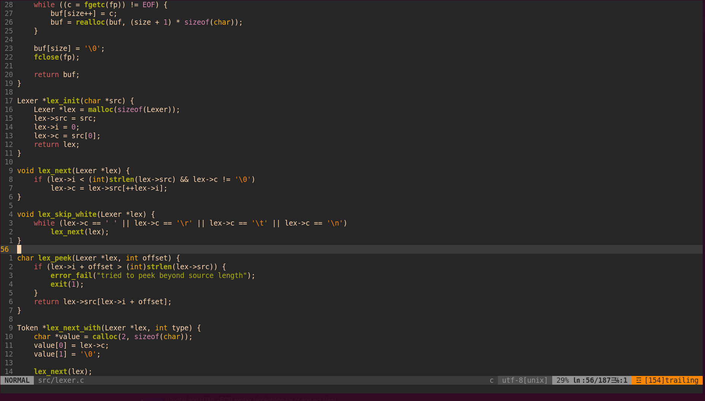

# vimrc



## Installation

1. Install vim:

``` bash
sudo apt install vim
```

2. Install vim-plug:

``` bash
curl -fLo ~/.vim/autoload/plug.vim --create-dirs \
    https://raw.githubusercontent.com/junegunn/vim-plug/master/plug.vim
```

3. Clone the repo and place ```.vimrc``` into ```~/.vimrc```.

## Usage

File tree: <kbd>Space</kbd> + <kbd>n</kbd>

Autocomplete: <kbd>Tab</kbd> and <kbd>Shift</kbd> + <kbd>Tab</kbd> to cycle through autocomplete options, <kbd>Enter</kbd> to select an option.
